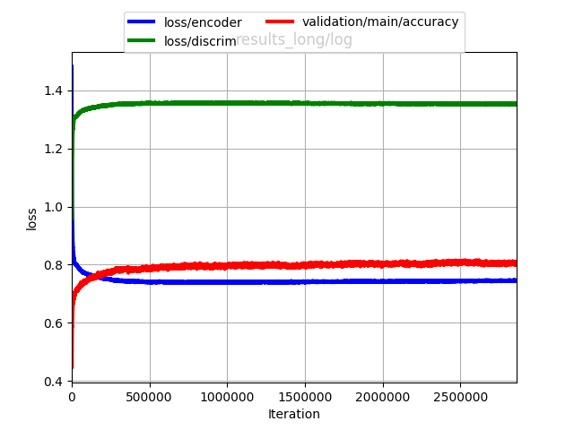

# chainer-ADDA
Adversarial Discriminative Domain Adaptation in Chainer (WIP).
Able to train adversarially, but not thoroughly checked and validated; stay tuned...

Note: this code depends on some Chainer pull requests (and one bit of uncommited code...). It probably won't run out of the box. I will sort this out ASAP.

## Usage
Run `python train.py -g 0` to train everything. SVHN and MNIST datasets will download automatically. If a classifier pretrained on the source (SVHN) domain is not found, one will be trained first, then continue on to do ADDA.

# Resources
- https://arxiv.org/pdf/1702.05464.pdf
- https://github.com/erictzeng/adda
- https://github.com/davidtellez/adda_mnist64
